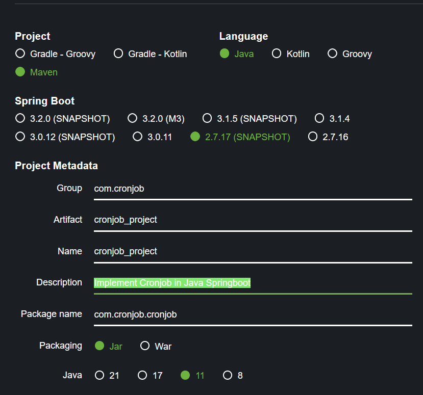

# Cronjob_Project

This cronjob project i build to implement my knowledge
about cronjob using java springboot

To run this project on you computer you need

- git
- java 11
- text edito (Intellij or vscode)
- maven

If you already have all of that, follow this step

- open your terminal or cmd
- type this on the terminal "git clone https://github.com/AdePutraGea28/cronjob_project.git"
- after clone process success open your text editor
- click file and click open
- find folder "cronjob_project"
- click select folder
- open your terminal and type "mvn spring-boot:run"
- and ta.. da.. the project successfully running
    

